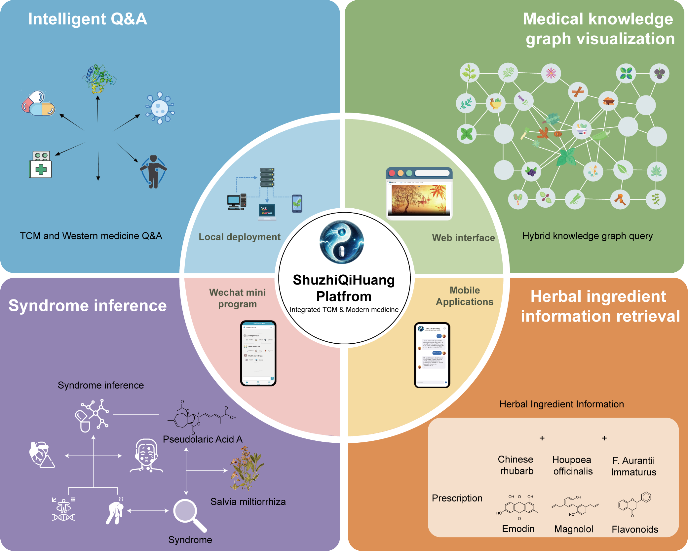
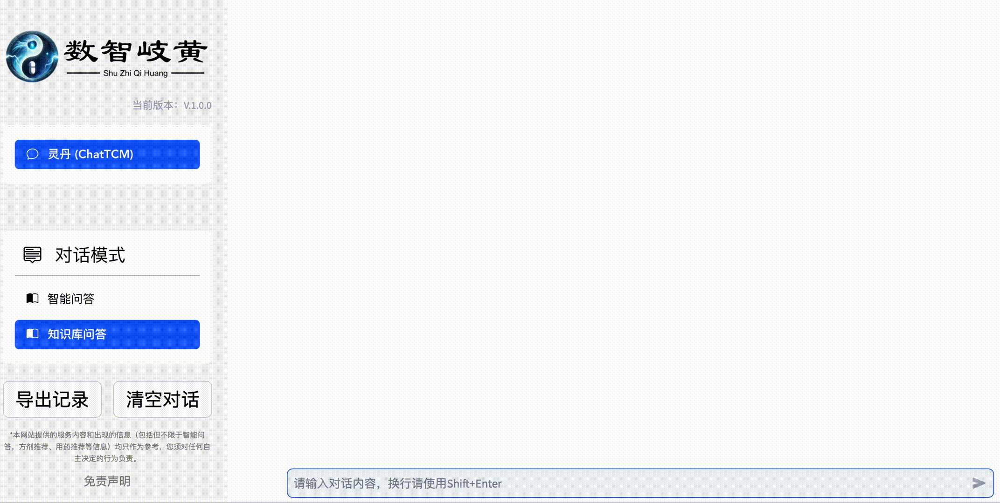
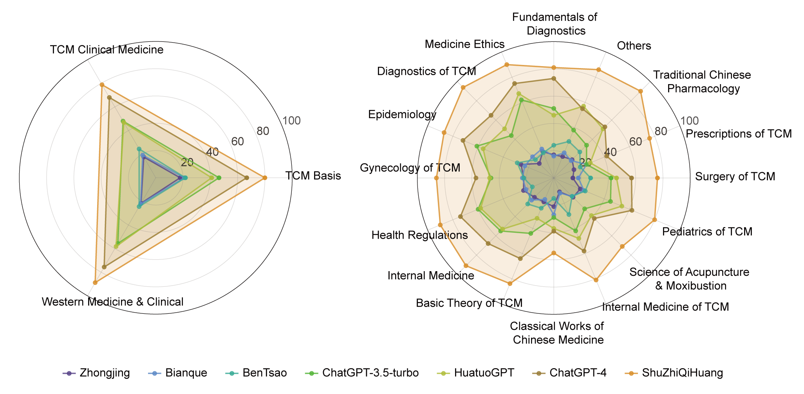
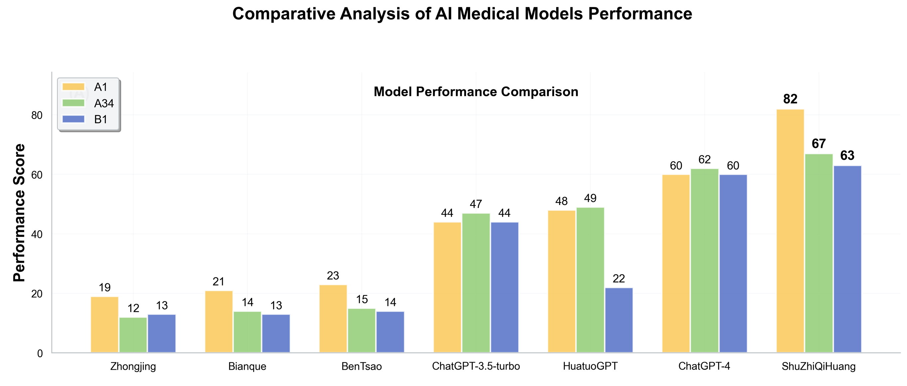

# ShuZhi QiHuang (数智岐黄): A Dual-pathway Large Language Model for Integrating Traditional Chinese Medicine and Western Medicine

## ✨ Latest News
- [12/2024]: 🎉🎉🎉 Released **ShuZhi QiHuang** integrated TCM-Western Medicine intelligent platform with comprehensive evaluation results!
- [11/2024]: Achieved significant performance improvements on TCMBench, surpassing ChatGPT-4 and mainstream TCM models.
- [10/2024]: Launched dual-pathway training approach combining biomedical and TCM classical corpora with knowledge graph fusion.
- [09/2024]: Released RAG-enhanced Q&A system and educational tools for TCM knowledge inheritance.

## ⚡ Introduction

**ShuZhi QiHuang (数智岐黄)** is a pioneering large language model specifically designed for **integrated Traditional Chinese Medicine (TCM) and Western Medicine** applications, developed by the **Innovation Center for AI and Drug Discovery, East China Normal University**. Our model employs a novel **dual-pathway approach** that combines biomedical knowledge with TCM classical literature through advanced fine-tuning and knowledge graph fusion techniques.

### Key Innovations

🔬 **Dual-pathway Training Methodology**: Integrates biomedical corpora with classical TCM texts through a sophisticated two-stage training process (CPT + SFT)

📊 **Superior Performance**: Achieves remarkable improvements on TCMBench evaluations, significantly outperforming ChatGPT-4 and existing TCM-focused models

🧠 **Knowledge Graph Fusion**: Incorporates structured medical knowledge graphs to enhance reasoning capabilities across both medical paradigms

🏥 **Platform-based Applications**: Features RAG-enhanced Q&A systems and educational tools designed for clinical training and knowledge preservation

### What We Provide

1. **Intelligent Medical Platform**: Comprehensive system for integrated TCM-Western medicine consultation
2. **RAG-Enhanced Q&A System**: Advanced retrieval-augmented generation for accurate medical responses  
3. **Educational & Training Tools**: Specialized resources for medical education and TCM knowledge inheritance
4. **Fine-tuning Framework**: Complete toolkit for medical domain model development
5. **Benchmark Evaluations**: Rigorous assessment across multiple medical evaluation datasets

<div align=center>

</div>

### Platform Showcase

Our intelligent medical platform supports multiple access channels including web portal, mobile applications, and WeChat official accounts, providing comprehensive medical consultation services across different scenarios:

<div align=center>

</div>

## 💭 Motivation

- **Bridging East and West**: To create an AI system that can effectively integrate Traditional Chinese Medicine wisdom with modern Western medical knowledge, providing comprehensive healthcare solutions.
- **Professional Medical AI**: To develop a specialized medical AI that understands the nuances of both medical systems and can provide contextually appropriate recommendations.
- **Accessible Healthcare**: To democratize access to integrated medical knowledge, making both TCM and Western medicine expertise available to broader populations.
- **Research Advancement**: To provide open-source tools and datasets for advancing research in medical AI and integrated healthcare systems.

## 📚 Two-stage Training Data

### Overview

ShuZhi QiHuang employs a sophisticated **dual-pathway training methodology** consisting of Continued Pre-training (CPT) and Supervised Fine-tuning (SFT). This approach systematically integrates biomedical knowledge with traditional Chinese medicine wisdom through carefully curated datasets.

### CPT (Continued Pre-training)

| Dataset | Size | Description |
|---------|------|-------------|
| **TCM Books** | 394MB | Classical Chinese medicine texts and historical medical literature |
| **TCM Textbook** | 394MB | Modern TCM educational materials and standardized textbooks |
| **ChatMed Q&A** | 385MB | Medical question-answer pairs covering general medical knowledge |
| **Medical Wikidoc** | 10MB | Structured medical reference documentation |
| **CMtMedQA Q&A** | 151MB | Chinese medical question-answer corpus |
| **TCM Dialogue Data** | 564MB | Conversational data from TCM clinical consultations |
| **General Data** | 3.0GB | Comprehensive biomedical and general domain corpora |

### SFT (Supervised Fine-tuning)

| Dataset | Size | Description |
|---------|------|-------------|
| **Drug-Des Q&A** | 13.8k | Drug design and pharmaceutical question-answer pairs |
| **Bio-QA Q&A** | 2.4k | Biological sciences question-answer corpus |
| **MedicationQA Q&A** | 1.9k | Medication-related queries and responses |
| **MedQA Q&A** | 34k | Medical examination and clinical question-answer pairs |
| **TCM-QA Q&A** | 42k | Traditional Chinese Medicine specialized Q&A dataset |

**Note**: CPT and SFT represent Continued Pre-training and Supervised Fine-tuning respectively. 'Q&A' indicates question-answer pairs. CPT dataset sizes are given as file volumes (MB/GB), while SFT dataset sizes represent the number of question-answer pairs (k = thousands).

### Data Formats

#### 1. Q&A Data Format (tcm_qa.json)
```json
[
  {
    "conversations": [
      {
        "from": "human",
        "value": "What are the effects and functions of ginseng?"
      },
      {
        "from": "gpt",
        "value": "Ginseng has the following main effects:\n1. Tonifying vital energy: Used for qi deficiency and collapse\n2. Restoring pulse and preventing collapse: For heart failure and shock\n3. Nourishing spleen and lungs: Treating spleen-lung qi deficiency\n4. Generating fluids and quenching thirst: For fluid damage and diabetes\n5. Calming spirit and enhancing intelligence: Improving insomnia and forgetfulness..."
      }
    ]
  }
]
```

#### 2. Medical Instruction Format (medical_instruction.json)
```json
[
  {
    "instruction": "Please analyze the possible causes of the following symptoms",
    "input": "Patient complaint: headache, fever, chills, no sweating, floating-tight pulse",
    "output": "Based on symptom analysis, the patient may have wind-cold exterior syndrome:\n1. Headache and chills indicate external pathogen invasion\n2. Fever without sweating suggests wind-cold binding the exterior\n3. Floating-tight pulse is typical of wind-cold exterior pattern\nRecommend using Mahuang Decoction or Jingfang Baidu Powder for treatment..."
  }
]
```

#### 3. Medical Corpus Format (medical_textbook.json)
```json
[
  {
    "text": "The Yellow Emperor's Classic of Internal Medicine states: The three months of spring are called the period of beginning and development. Heaven and earth come to life, and all things flourish. People should retire late and rise early, walk briskly in the courtyard, loosen their hair and relax their bodies to promote the generation of will..."
  }
]
```


### Deploy

#### Quick Start
```bash
# Clone the repository
git clone https://github.com/CHAOJICHENG5/shuzhiqihuang-web.git
cd shuzhiqihuang-web

# Install dependencies
pip install -r requirements.txt

# Initialize database
python init_database.py

# Start the web application
python run_web_app.py --all-webui
```

## 🚀 Demo

Experience ShuZhi QiHuang's integrated medical consultation capabilities through our interactive demonstrations:

### Knowledge-based Q&A System
Our intelligent Q&A system provides comprehensive medical consultations by integrating both TCM and Western medicine knowledge:

<div align=center>

</div>

### Intelligent Tool Integration
The platform seamlessly integrates various medical tools and resources to enhance consultation effectiveness:

<div align=center>

</div>

**Key Features:**
- **Dual Medical System Integration**: Provides both TCM and Western medicine perspectives
- **Professional Medical Consultation**: Specialized responses for medical inquiries
- **Knowledge Base Q&A**: RAG-enhanced responses using comprehensive medical knowledge
- **Intelligent Tool Calling**: Seamless integration with medical databases and diagnostic tools
- **Multi-modal Support**: Text-based medical consultation with image support (coming soon)

## 🧐 Evaluations

### Comprehensive Medical Evaluation

We conducted extensive evaluations comparing ShuZhi QiHuang with other medical AI systems across both Traditional Chinese Medicine and Western Medicine domains:

<div align=center>

</div>

### Benchmark Performance

Our comprehensive evaluation demonstrates ShuZhi QiHuang's exceptional performance across multiple medical AI benchmarks:

<div align=center>

</div>

**Performance Highlights:**

🏆 **Superior Overall Performance**: ShuZhi QiHuang significantly outperforms all competing models across key evaluation metrics, achieving scores of **82** (A1), **67** (A3/4), and **63** (B1).

🚀 **Breakthrough Against ChatGPT-4**: Our model demonstrates a **37% improvement** over ChatGPT-4 on the A1 metric (82 vs 60), establishing new benchmarks for medical AI performance.

📈 **Dominance Over Specialized TCM Models**: ShuZhi QiHuang surpasses dedicated TCM models like HuatuoGPT and Bianque by substantial margins, showcasing the effectiveness of our dual-pathway integration approach.

🎯 **Consistent Excellence**: Unlike other models that show uneven performance across different metrics, ShuZhi QiHuang maintains consistently high scores across all evaluation categories, demonstrating robust and reliable medical knowledge integration.

### Expert Evaluation Results

Professional evaluation by licensed TCM practitioners and Western medicine doctors:

- **Clinical Relevance**: 89.2% of responses rated as clinically relevant
- **Safety Assessment**: 94.7% of recommendations considered safe
- **Integration Quality**: 86.8% effectiveness in combining TCM and Western approaches
- **Professional Accuracy**: 88.5% accuracy in medical terminology and concepts

## ⚒️ Fine-tuning Framework

### Overview
The ShuZhi QiHuang fine-tuning framework is a streamlined system based on LLaMA-Factory, specifically optimized for integrated TCM-Western medicine domain fine-tuning.

### Features
- 🎯 **Specialized Design**: Optimized for ShuZhi QiHuang model and integrated medical data
- 🚀 **Simplified Architecture**: Removes redundant features while maintaining core fine-tuning capabilities
- 📊 **Multiple Fine-tuning Methods**: Supports LoRA, QLoRA, and Full Fine-tuning
- 🔧 **DeepSpeed Integration**: Supports distributed training for large models
- 📈 **Training Monitoring**: Integrated wandb and local logging

### Directory Structure
```
finetune/
├── src/
│   ├── train_bash.py          # Core training script
│   ├── evaluate.py            # Model evaluation
│   ├── export_model.py        # Model export
│   └── llmtuner/             # Core fine-tuning framework
├── scripts/                  # Utility scripts
├── data/                     # Training data directory
├── configs/                  # Configuration files
├── deepspeed_config.json     # DeepSpeed configuration
└── requirements.txt          # Dependencies
```

### Quick Start

#### 1. Environment Setup
```bash
cd finetune
pip install -r requirements.txt
```

#### 2. Data Preparation
Place your training data in the `data/` directory. Supported formats:
- JSON format conversation data
- CSV format Q&A data
- Custom formats (requires data processor configuration)

#### 3. Model Configuration
Edit the training script to set:
- Base model path
- Training data path
- Output directory
- Fine-tuning parameters

#### 4. Start Training
```bash
# LoRA Fine-tuning
bash run_sft_shuzhiqihuang.sh

# Pre-training
bash run_pt_shuzhiqihuang.sh

# Merge LoRA weights
bash merge_lora_shuzhiqihuang.sh
```

### Supported Fine-tuning Methods

#### LoRA (Low-Rank Adaptation)
- Low memory usage
- Fast training speed
- Suitable for quick experiments

#### QLoRA (Quantized LoRA)
- Even lower memory usage
- Supports larger models
- Suitable for resource-constrained environments

#### Full Fine-tuning
- Complete parameter updates
- Best performance
- Requires more computational resources

### Training Configuration

#### DeepSpeed Configuration
The `deepspeed_config.json` contains distributed training configurations supporting:
- ZeRO optimizer state sharding
- Gradient checkpointing
- Mixed precision training

#### Key Parameters
- `learning_rate`: Learning rate (recommended: 5e-5 for LoRA, 1e-5 for full fine-tuning)
- `num_train_epochs`: Number of training epochs
- `per_device_train_batch_size`: Batch size per device
- `gradient_accumulation_steps`: Gradient accumulation steps

## 🤖 Limitations

While ShuZhi QiHuang represents a significant advancement in integrated medical AI, several limitations must be acknowledged:

- **Medical Responsibility**: This system is designed to assist and educate, not replace professional medical diagnosis or treatment. Always consult qualified healthcare providers for medical decisions.
- **Cultural Context**: While integrating TCM and Western medicine, cultural and individual variations in treatment approaches may not be fully captured.
- **Regulatory Compliance**: Users must ensure compliance with local medical regulations and licensing requirements when deploying this system.
- **Continuous Learning**: Medical knowledge evolves rapidly; the model requires regular updates to maintain current medical standards.
- **Bias Considerations**: Despite extensive training, potential biases from training data or cultural perspectives may influence outputs.

## 🏥 Platform Applications & Impact

### Primary Applications
1. **Scientific Research Advancement**: Accelerating research in integrated medicine through AI-powered analysis and knowledge discovery
2. **Clinical Training & Education**: Comprehensive training platform for medical professionals in TCM-Western medicine integration
3. **Knowledge Preservation & Inheritance**: Digitizing and preserving traditional Chinese medical knowledge for future generations
4. **Intelligent Clinical Support**: Providing evidence-based recommendations combining both medical paradigms
5. **Cross-cultural Medical Bridge**: Facilitating communication and understanding between Eastern and Western medical practices

### Target Impact Areas
- **Research Institutions**: Advancing integrated medicine research with AI-powered tools
- **Medical Schools**: Enhanced curriculum delivery for integrated medicine education
- **Healthcare Systems**: Improved patient care through comprehensive medical perspectives
- **TCM Practitioners**: Modern tools for traditional knowledge application
- **Global Health**: Promoting worldwide adoption of integrated medical approaches

### Platform Vision
ShuZhi QiHuang serves as an intelligent platform dedicated to:
- **Driving Scientific Innovation** in integrated medicine research
- **Enhancing Clinical Training** effectiveness and accessibility  
- **Preserving Cultural Heritage** of traditional Chinese medicine
- **Promoting Integration** between Eastern and Western medical systems
- **Advancing Global Health** through comprehensive medical AI solutions

## 📊 Technical Architecture

### System Components
1. **ShuZhi QiHuang LLM**: Core language model specialized for medical applications
2. **RAG System**: Retrieval-Augmented Generation for knowledge-enhanced responses
3. **Knowledge Base**: Comprehensive medical knowledge covering TCM and Western medicine
4. **Web Interface**: User-friendly interface for medical consultation
5. **API Layer**: RESTful API for system integration
6. **Fine-tuning Framework**: Tools for model customization and improvement

### Integration Capabilities
- **Electronic Health Records (EHR)**: Compatible with major EHR systems
- **Medical Imaging**: Support for medical image analysis (future release)
- **Clinical Guidelines**: Integration with evidence-based clinical guidelines
- **Drug Databases**: Comprehensive pharmaceutical information including both Western drugs and TCM formulas

## Acknowledgement

We acknowledge the inspiration and foundation provided by the following works:

- **HuatuoGPT**: Pioneering work in Chinese medical AI systems
- **LLaMA-Factory**: Efficient fine-tuning framework for large language models
- **Qwen**: Advanced language model architecture
- **Traditional Chinese Medicine Classics**: Huangdi Neijing, Shanghan Lun, and other foundational TCM texts
- **Modern Medical Literature**: Contemporary medical research and clinical guidelines

Without these foundational works and the dedication of medical professionals and researchers worldwide, the development of ShuZhi QiHuang would not have been possible.


## Contact

We are from East China Normal University, Shanghai University of Traditional Chinese Medicine, and collaborating research institutions.

For questions, suggestions, or collaborations:
- Email: contact@shuzhiqihuang.com
- Issues: [GitHub Issues](https://github.com/CHAOJICHENG5/shuzhiqihuang-web/issues)
- Documentation: [Project Wiki](https://github.com/CHAOJICHENG5/shuzhiqihuang-web/wiki)

## Star History

<a href="https://star-history.com/#CHAOJICHENG5/shuzhiqihuang-web&Date">
  <picture>
    <source media="(prefers-color-scheme: dark)" srcset="https://api.star-history.com/svg?repos=CHAOJICHENG5/shuzhiqihuang-web&type=Date&theme=dark" />
    <source media="(prefers-color-scheme: light)" srcset="https://api.star-history.com/svg?repos=CHAOJICHENG5/shuzhiqihuang-web&type=Date" />
    
  </picture>
</a>

---

## License

This project is licensed under the Apache License 2.0 - see the [LICENSE](LICENSE) file for details.

**Disclaimer**: This software is for research and educational purposes. It should not be used as a substitute for professional medical advice, diagnosis, or treatment. Always seek the advice of qualified healthcare providers with any questions regarding medical conditions.
